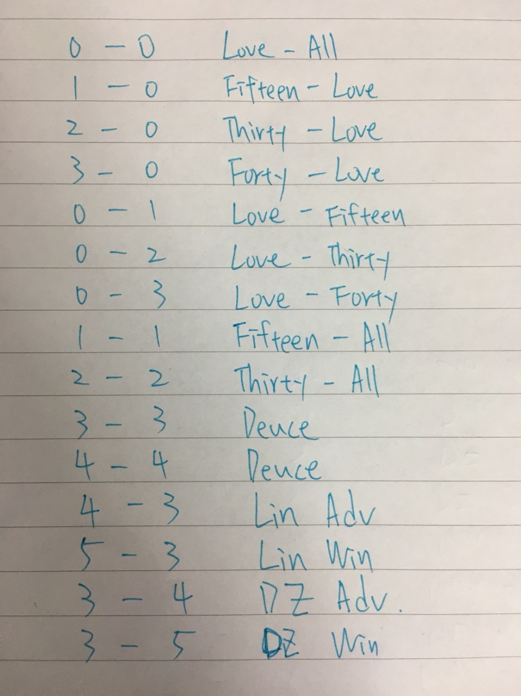

# Tennis Kata
## 專案介紹
本專案透過 Tennis Kata 熟悉 vim 語法，並在限時 20 分鐘內完成。

## 設定
* IDE: Rider 2025.1
* Project Type: Unit Test
* Target framework: net8.0
* Language: C#
* Type: NUnint3
* NuGet: FluentAssertions 8.2.0
* Plugins:
  * IdeaVim 2.22.0
  * AceJump 3.8.19

## Demo
Youtube: [Tennis_Kata](https://youtu.be/pNIgM9g9xIk)

## Test Case

